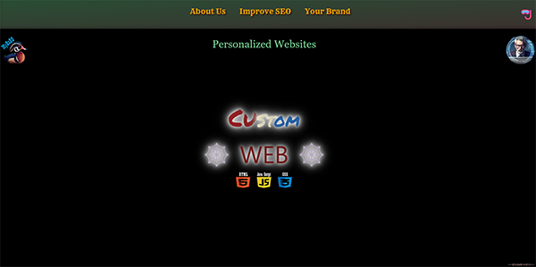

 <!-- note to self Just push it and it will launch to gitgub pages -->
 <!-- to run the project just GoLive don't forget to  'npm run tailwind' -->
# Tailwind Portfolio Project

This project showcases my skills and experience with Tailwind CSS, built upon the foundation of Dave Gray’s Tailwind Course. I’ve extensively modified and expanded upon the course material, tailoring it to my specific needs and incorporating additional functionalities.

## Additional Features

Beyond the course content, I’ve added new features and functionalities to enhance the user experience.

## Visual Appeal

I’ve focused on creating visually appealing interfaces that engage users. This project serves as a demonstration of my capabilities within my portfolio, highlighting my proficiency in building dynamic and visually appealing web experiences using Tailwind CSS.

Feel free to explore the code and see how I’ve leveraged Tailwind CSS to create this project!

