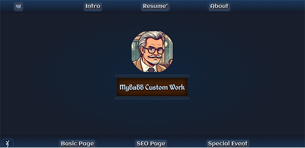

 <!-- note to self "npm run deploy" to gh pages -->
 PROJECT STARTED ON 3-29-2024
### To format the jsx file "npm run format" will format Prettier everything at once.
# Tailwind Portfolio Project Conversion to ReactJS.

### prettier, gh-pages, Tailwind, Google-fonts, extend-Colors

This is A simple Landing page for use as a Resume'

## Additional Features

I have built this as my simple landing page with links to some of my things.  To use for help finding work.

## Visual Appeal

I’ve focused on creating visually appealing interfaces that engage users. This project serves as a demonstration of my capabilities within my portfolio, highlighting my proficiency in building dynamic and visually appealing web experiences using Tailwind CSS,React and will now enhance it as I go along with Javascript Animations and such along with using svg's in Figma combined with Stable-Fusion, Adobe-PhotoShop, and Adobe-Illustrator.

Feel free to explore the code and see how I’ve leveraged Tailwind CSS to create this project!

